# Technical Design & Diagrams

**Audience: developers maintaining this codebase.** Assumes Go, SQL, and
working familiarity with RADIUS. For day-to-day operation of the running
system, see `21_OPG_Operator_Guide.md` instead — that document covers the same
software from the console, not from the source.

Written 2026-08-16 against commit `ec11140`. Diagrams are Mermaid and render on
GitHub. Where a diagram and the code disagree, the code is right and this
document is stale — every structural claim here was derived by reading
`internal/`, `cmd/`, and `migrations/` rather than from an earlier design doc.

---

## 1. What this system is

A BSS/OSS platform for an Indian ISP: it authenticates subscribers onto the
network, meters what they use, bills them under GST, and gives staff the
screens to run all of that. Two things make it more than a CRUD application —
it speaks RADIUS to network hardware in real time under a 15 ms p99 budget, and
it is the system of record for regulatory obligations (GST retention, DoT
subscriber verification, LEA lookups) where being wrong has consequences beyond
a bug report.

### 1.1 System context

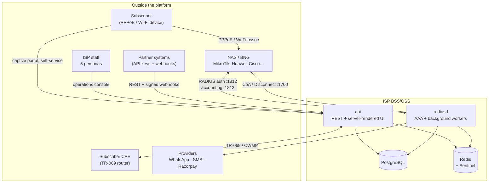

Two binaries, deliberately split by latency class rather than by domain:

| Binary | Responsibility | Why separate |
|---|---|---|
| `cmd/radiusd` | RADIUS auth (`:1812`) and accounting (`:1813`), plus every background scanner and async worker | Authentication is on a hard latency budget and must not compete with report generation or PDF rendering |
| `cmd/api` | REST API, subscriber portal, operations console, captive portal, TR-069 ACS | HTTP-shaped work with second-scale tolerances |
| `cmd/radload` | Load-test client for NFR-PERF-001 | Test tool, not deployed |

Both binaries share `internal/db` and `internal/config`; neither calls the
other. Coordination is through PostgreSQL and Redis only.

---

## 2. Module map

24 packages under `internal/`. They fall into four bands:

```mermaid
graph TB
    subgraph edge["Edge — protocol and presentation"]
        RADIUS["radius<br/>RADIUS AAA"]
        APIM["api<br/>REST routes"]
        PORTALUI["portalui<br/>subscriber web UI"]
        STAFFUI["staffui<br/>operations console"]
        HOTSPOT["hotspot<br/>captive portal"]
        TR069["tr069<br/>CWMP ACS"]
        PORTAL["portal<br/>subscriber API"]
    end

    subgraph domain["Domain — business rules"]
        BILLING["billing<br/>GST, wallet, dunning"]
        FUP["fup<br/>quota enforcement, CoA"]
        REVENUE["revenue<br/>reconciliation, commission"]
        TICKETS["tickets<br/>helpdesk + SLA"]
        CRM["crm<br/>lead pipeline"]
        INVENTORY["inventory<br/>CPE stock"]
        WORKFLOW["workflow<br/>approvals, field tasks"]
        NOTIF["notifications<br/>multi-channel dispatch"]
        REPORTING["reporting<br/>views + CSV export"]
        ARCHIVE["archive<br/>document retention"]
        NAS["nas<br/>vendor attribute engine"]
        PARTNER["partner<br/>API keys, webhooks"]
        HEALTH["health<br/>diagnostic endpoint"]
    end

    subgraph infra["Infrastructure"]
        DB["db<br/>PostgreSQL layer"]
        CACHE["cache<br/>Redis session state"]
        MW["middleware<br/>JWT + RBAC"]
        CONFIG["config"]
        CRYPTO["pkg/crypto<br/>AES-GCM key store"]
        VALIDATE["pkg/validate"]
    end

    edge --> domain
    domain --> infra
    edge --> infra
```

**The dependency rule that shapes everything:** domain packages declare the
storage interfaces they need; `internal/db` implements them. So `fup` defines
`FUPQuerier` and `db.FUPStore` satisfies it — the domain never imports the
database layer. This is why `internal/db` imports `internal/api`, and not the
reverse, and why new shared types (`nas.NewNASDevice`, `hotspot.OverCapGrant`)
live in the domain package rather than in `db`.

---

## 3. The RADIUS path (most latency-sensitive)

`internal/radius`, `internal/nas`, `internal/cache`, `internal/fup`.

### 3.1 Authentication — structure

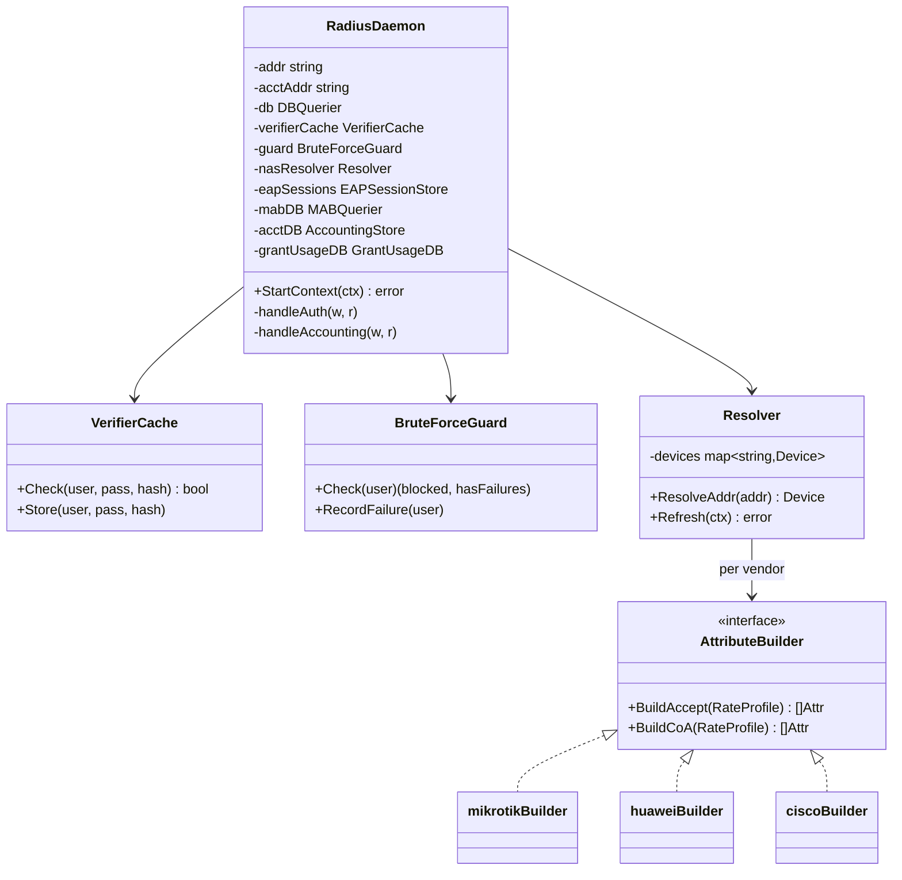

Eight vendor builders exist (MikroTik, Huawei, ZTE, Cisco, Juniper, Cisco WLC,
Aruba, Ruckus). They split into two families: *dynamic-rate* vendors that take
a rate-limit string directly, and *policy-reference* vendors that take a
pre-provisioned profile name resolved through `plan_nas_profiles`. An
unrecognised vendor falls back to MikroTik rather than failing the
authentication.

### 3.2 Authentication — behaviour

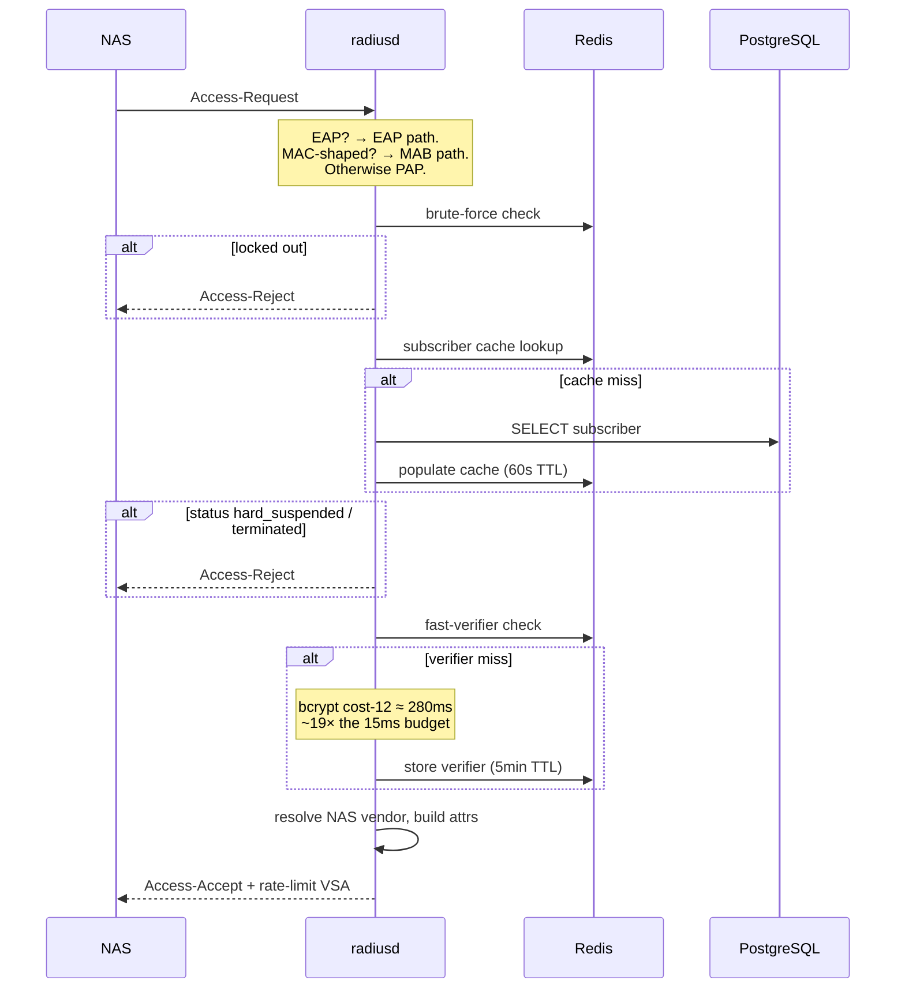

The fast-verifier cache is what makes the 15 ms p99 achievable. bcrypt at
cost-12 is roughly 280 ms — nineteen times the entire budget — so a repeat
authentication must not pay it. The cache is keyed on username *and* the
current password hash, so a password change self-invalidates immediately rather
than leaving a stale verifier valid for its TTL.

Measured 2026-08-16: **p99 13.224 ms** at 5,000 req/s over 30 s, 149,900
requests, zero errors.

### 3.3 Accounting

This is the path that populates `subscriber_session_history`, and almost
everything downstream reads it: FUP enforcement, CoA targeting, LEA lookups,
and the portal's usage history.

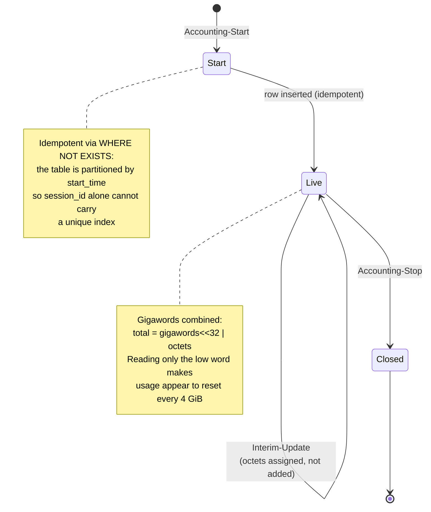

Three properties that are easy to get wrong and are load-bearing here:

- **Both ports must be bound.** RFC 2866 puts accounting on `:1813`; a daemon
  listening only on `:1812` silently discards every accounting packet.
- **Octets are assigned, not accumulated.** Interim updates carry a running
  total; adding them multiplies usage by the number of updates received.
- **Gigawords are not optional.** `Acct-Input-Octets` is a 32-bit counter that
  wraps every 4 GiB, with wraps in `Acct-Input-Gigawords`. Ignoring them
  disables quota enforcement precisely for the heaviest users.

### 3.4 Quota enforcement (FUP) and CoA

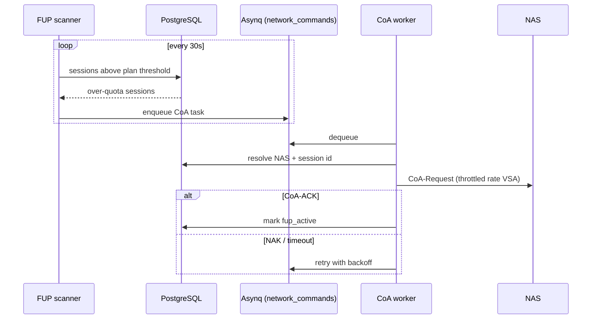

Two distinct enforcement paths exist, and conflating them causes real bugs:

| Session type | Metered in | Enforced by | On breach |
|---|---|---|---|
| Subscriber (PPPoE, or MAB for a registered device) | `subscriber_session_history` | `fup.Scanner` | **Throttle** via CoA |
| Voucher-backed hotspot | `hotspot_grants.bytes_used` | `hotspot.QuotaScanner` | **Disconnect** via PoD + revoke |

Voucher sessions cannot use the subscriber path: `chk_grant_has_exactly_one_source`
means a voucher grant has no subscriber row, and `subscriber_session_history.subscriber_id`
is `NOT NULL` with a foreign key. Hence the separate meter on the grant itself.
A voucher disconnects rather than throttles because it is prepaid for a fixed
volume — a crawl afterwards reads as a broken network rather than a spent
voucher.

---

## 4. Captive portal (`internal/hotspot`)

The only unauthenticated HTTP surface in the system, which is why its controls
are structural rather than conventional.

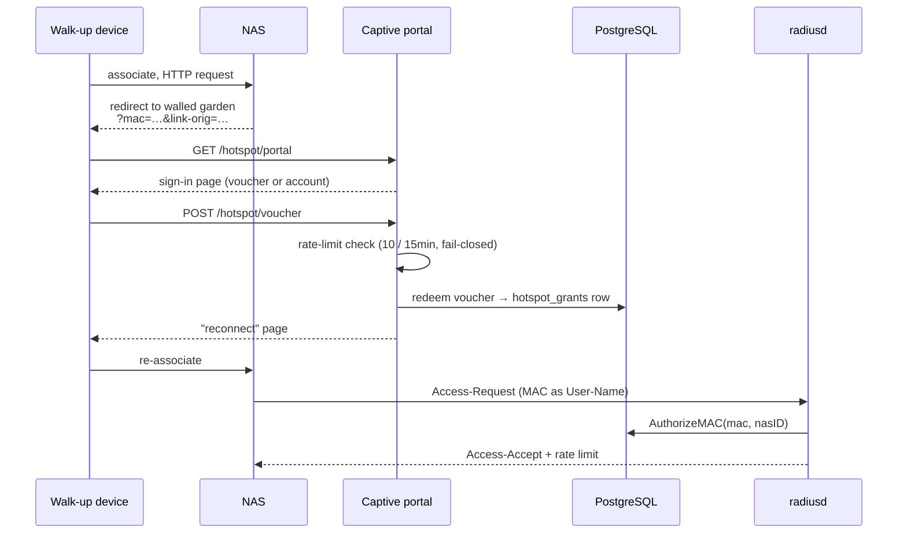

Design decisions worth knowing before changing anything here:

- **The portal never grants network access itself.** It writes a grant; the NAS
  still authenticates the MAC over RADIUS. A compromised portal cannot admit a
  session on its own.
- **Issuance is separate from redemption.** Voucher creation lives behind staff
  auth on `/api/v1/hotspot/vouchers`; the public surface can only redeem what
  staff already issued.
- **Refusals are uniform.** Wrong code, expired code, and already-redeemed code
  produce the same response, so the endpoint is not an oracle for which codes
  exist.
- **The limiter fails closed.** If Redis is unavailable the endpoint refuses
  rather than admits — an unmetered voucher endpoint is worse than an
  unavailable one.
- Codes are 12 characters over a 30-symbol alphabet with `0/O/1/I/L` removed,
  stored SHA-256, and returned exactly once at generation.

---

## 5. Billing and revenue

`internal/billing`, `internal/revenue`.

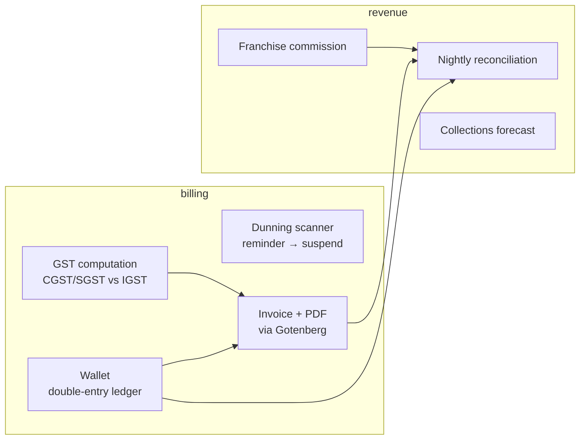

GST is intrastate (CGST+SGST) or interstate (IGST), never both — enforced by
`chk_gst_logic` on `invoices` rather than trusted to application code. Money is
`decimal.Decimal` throughout and `NUMERIC` in the database; float64 appears
nowhere in a monetary path.

### Dunning lifecycle

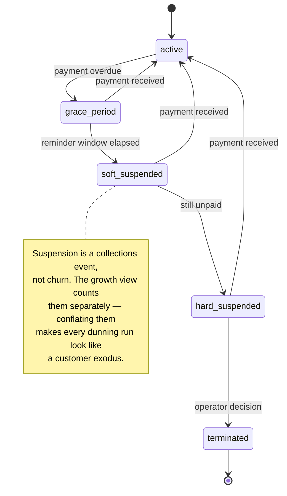

Every transition is captured in `subscriber_status_history` by a database
trigger rather than by application code, so a transition is recorded even when
made by a path nobody remembered to instrument, or by hand at 2am.

---

## 6. Document archival (`internal/archive`)

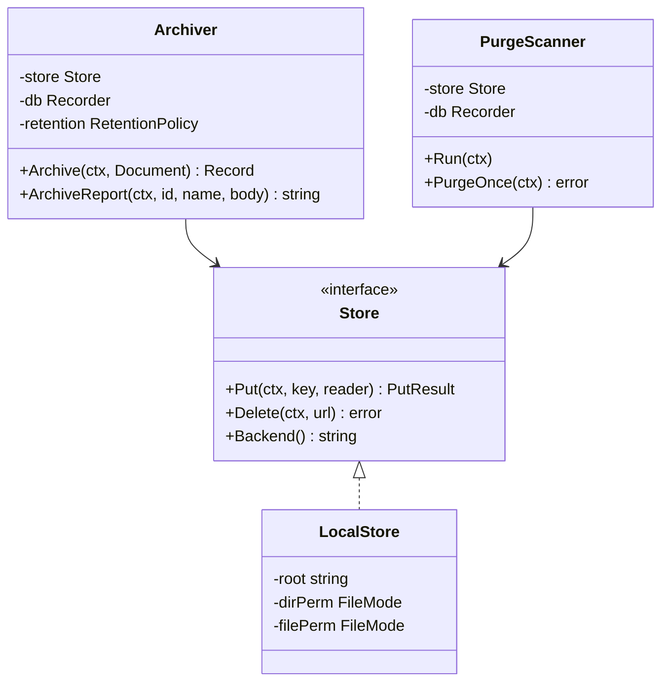

Retention is **calendar-based**, not a fixed duration: eight 365-day years fall
two days short of eight calendar years, which would delete GST records before
the statute allows in a way nobody would ever notice.

| Kind | Retention | Basis |
|---|---|---|
| `invoice` | 8 years | GST rules require 72 months from the annual return's due date; the margin covers the gap from invoice date |
| `kyc_document` | 5 years | DoT licence conditions, bounded by the DPDP Act's storage-limitation principle |
| `report` | 1 year | Regenerable from source data |

Ordering is deliberate in both directions: **archival writes bytes then the
row** (a row promising a missing document is worse than an orphaned file);
**purge deletes bytes then marks the row** (marking first leaves a file the
system believes is gone, which nothing will revisit).

> **Known gap.** `Store` has `Put` and `Delete` but no retrieval method. The
> checksum is computed from the bytes actually written, so corruption at write
> time is detectable — but there is no code path to read a document back and
> re-verify it. For a feature holding 8-year GST invoices this matters; adding
> `Store.Get` is the natural next slice.

---

## 7. Reporting and export (`internal/reporting`)

Four objects from migration 032 — three plain views and one materialised view:

| Object | Grain | Materialised |
|---|---|---|
| `v_plan_mix` | plan × franchise, current state | No — "what is our plan mix" is a question about now |
| `v_subscriber_growth_monthly` | month × franchise × plan | No |
| `v_franchise_collection` | franchise × month | No |
| `mv_ticket_resolution` | month × category × priority × franchise | **Yes** — computes a percentile across every ticket ever filed |

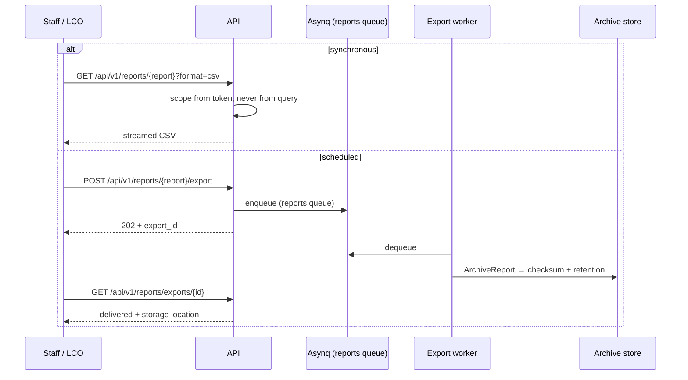

Both paths share one encoder, so a scheduled report is byte-identical to the
one on screen. Exports run on their own queue below `network_commands`,
because a ten-year aggregate ahead of a CoA leaves a subscriber unthrottled for
its duration.

**Franchise scoping is derived from the caller's token, never from a request
parameter.** A franchise-bound caller cannot widen their view by editing a URL
or request body, and a scoped role whose token carries no `franchise_id` is
refused rather than defaulted to ISP-wide.

Measured 2026-08-16 at 120 months against 20,000 subscribers / 434k invoices:
collection p99 **1.69 s**, growth **57 ms**, ticket-resolution **6.7 ms**.

---

## 8. Observability and alerting

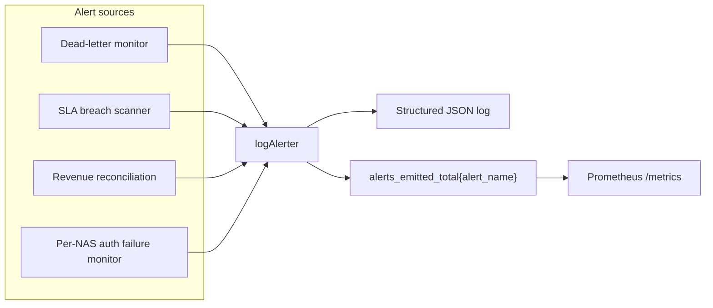

The per-NAS auth failure monitor (FR-OBS-005) is worth understanding because
its design encodes two lessons:

- **Rates come from a window, not from cumulative counters.** The counters
  never reset, so absolute values would average over the process lifetime — an
  outage last week would keep the alert firing forever, and one happening now
  would be diluted by a week of healthy traffic.
- **A minimum-volume guard is mandatory.** One failed authentication on an idle
  NAS is a 100 % failure rate. Without the guard the alert fires constantly on
  the quietest sites until everyone ignores it, making a real outage on a busy
  NAS indistinguishable from noise.

`deploy/prometheus/radius_alerts.yml` carries the same rule in PromQL for
deployments that run Prometheus; a test asserts the two thresholds agree.

> **Open decision.** `logAlerter` writes a log line and increments a counter.
> That satisfies "emit a proactive alert" literally and nobody at 3am. Choosing
> a real destination — Alertmanager, a webhook, the notification service that
> already sends WhatsApp — is unresolved, and `staff_users` carries no contact
> details to route to.

---

## 9. Data model — core entities

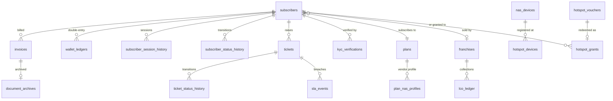

42 tables and 4 views across 35 migrations. Three schema decisions that
constrain application code:

1. **`subscriber_session_history` is partitioned by `start_time`.** PostgreSQL
   requires the partition key in any unique index, so `session_id` alone cannot
   carry one — idempotent inserts use `WHERE NOT EXISTS` instead of
   `ON CONFLICT`.
2. **`hotspot_grants` has exactly one source.** `chk_grant_has_exactly_one_source`
   means a grant is voucher-backed *or* subscriber-backed, never both and never
   neither. This is why voucher sessions need their own metering path.
3. **PII is encrypted at rest with a versioned key.** `kyc_verifications`,
   `nas_devices.radius_secret_encrypted`, and partner webhook secrets all store
   `{key_version}:{base64(nonce+ciphertext)}` and reference `encryption_keys`.
   Ciphertext and key version always move together — a mismatch makes the value
   undecryptable.

---

## 10. Security model

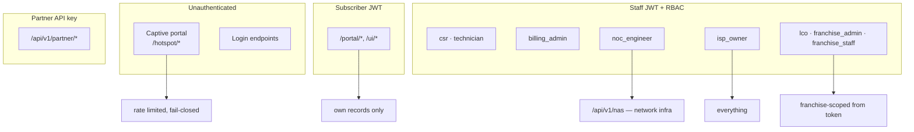

Authorisation notes that are easy to get wrong:

- **LEA access is a claim, not a role.** `RequireLeaAccess` sits *behind*
  `RequireRole`, so LEA authorisation is "noc **and** lea_flag" — both
  conditions. Granting it can never be a side effect of a role assignment.
- **Franchise scope comes from the token.** A scoped role with no
  `franchise_id` claim is refused rather than treated as ISP-wide; defaulting a
  missing claim to "everything" would turn a misissued token into a
  cross-partner data leak.
- **NAS secrets are never returned.** `DeviceSummary` is a separate type from
  `DeviceRow` with a separate query that never selects the ciphertext column —
  structural, so it cannot leak by someone adding a JSON tag.
- **All auth errors share one envelope.** `{code, message}` with an `ERR_*`
  code, including from middleware. This was not always true: the JWT middleware
  answered `text/plain` while every handler answered JSON, making token expiry
  — the most common error a mobile client sees — the one response its parser
  could not read.

---

## 11. Deployment

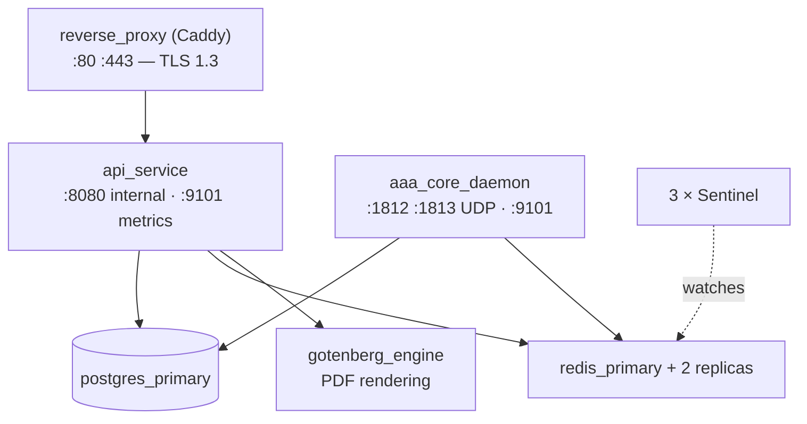

The API container publishes only `9101` (metrics); application traffic goes
through the reverse proxy, so probe `https://localhost/...` rather than
`localhost:8080`. PostgreSQL HA (Patroni + etcd) is an opt-in overlay
(`docker-compose.pg-ha.yml`), not the default.

---

## 12. Verification

| Layer | Command | Scale |
|---|---|---|
| Unit | `go test ./...` | 24 packages with tests |
| Persistence | `bash scripts/run_db_tests.sh -timeout 25m` | ~700–880 s against real PostgreSQL |
| Browser | `npx playwright test` | 45 tests, 5 staff personas + portal |
| Performance | `bash scripts/run_nfr_tests.sh` | 4 NFRs at DoD-specified load |
| Wiring | `bash scripts/check_wiring.sh` | 22 components |
| Migrations | `bash scripts/verify_migrations.sh` | up **and** down |

The DB suite **must** carry `-timeout 25m`; Go's 10-minute default kills it
partway, which reads as a hang rather than a timeout.

`check_wiring.sh` deserves explanation. It is a grep, not a test, and it exists
because components have shipped complete, correct, fully tested, and called by
nothing. The canonical case: RADIUS accounting persistence — `StartSession`,
`UpdateSessionOctets` and `StopSession` were written and tested, nothing called
them, `:1813` was unbound, and four features silently read an empty table while
their own tests passed. When adding a long-running component, add it there too,
and prefer tracking the call that proves it is *mounted* over one that proves it
was merely constructed.

---

## 13. Known gaps

Carried from `HANDOFF.md`; listed here so a reader of this document is not
misled by the parts that look complete.

| Gap | Consequence |
|---|---|
| `archive.Store` has no retrieval method | Cannot verify an archived document without hashing the file by hand |
| Captive portal doesn't complete MikroTik's native login | Users must reconnect; needs `login-by=mac` on the hotspot profile |
| Archival is local-filesystem only | A copy on the same machine is not disaster recovery |
| `logAlerter` only logs | No paging destination configured |
| FR-AAA-005 (plain CHAP) deferred | Requires storing recoverable plaintext passwords |
| 116 lint findings under the integration tag | Mostly `noctx` in tests; enough noise to hide a real one |
| 1-hour soak (L6-005) never run | Goroutine-leak behaviour under sustained load unproven |
