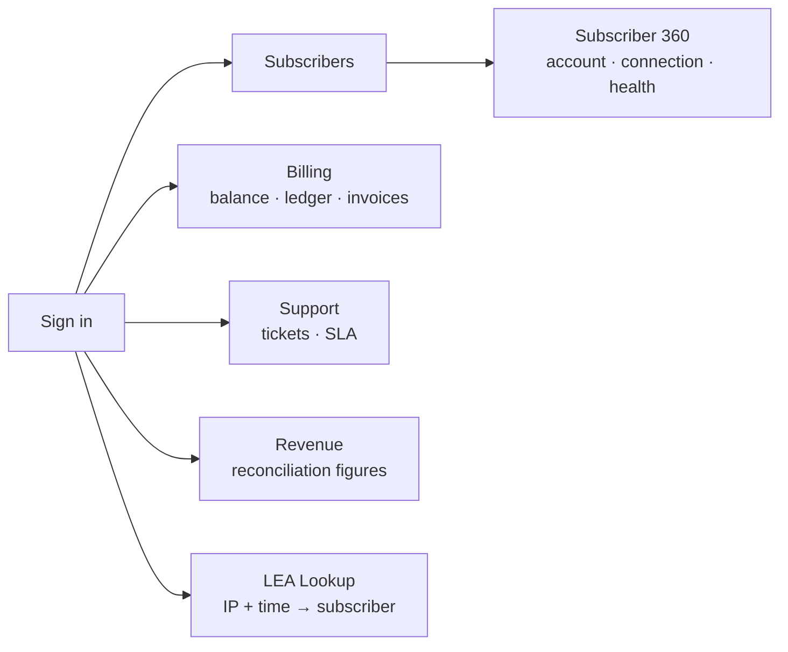

# Operator Guide — running and using the system

**Audience: ISP staff and operators.** This covers what the software does from
the console, what each screen is for, and how to carry out the common tasks.
For internals — module structure, interfaces, why things are built the way they
are — see `20_TDD_Technical_Design_And_Diagrams.md` instead.

Written 2026-08-16 against commit `ec11140`, verified against a running demo
stack.

---

## 1. Starting the system

```bash
./scripts/demo_up.sh
export COMPOSE_PROJECT_NAME=isp_bss_demo   # demo_up.sh hardcodes this
```

Without `COMPOSE_PROJECT_NAME` every subsequent `docker compose` command
targets a different project and reports containers as not running.

Once up, three web surfaces are available through the reverse proxy:

| Surface | URL | Who signs in |
|---|---|---|
| Operations console | `https://localhost/staff` | ISP staff |
| Subscriber portal | `https://localhost/ui` | Subscribers |
| Captive portal | `https://localhost/hotspot/portal` | Walk-up Wi-Fi users |

The demo certificate is self-signed, so a browser will warn on first visit.

> **Two traps worth knowing.** The API container publishes only port `9101`
> (metrics) — application traffic goes through the proxy, so use
> `https://localhost/...`, never `localhost:8080`. And `docker compose up -d`
> reuses the existing image: after pulling new code you must
> `docker compose build api_service aaa_core_daemon` first, or new features
> return 404 and a correct fix looks broken.

### Demo accounts

Seeded by `scripts/seed_local.sql`. **These must never exist in a real
deployment** — the passwords are published in this repository.

| Console | Username | Password |
|---|---|---|
| Staff | `owner`, `noc`, `billing`, `csr`, `tech` | `staffpassword` |
| Subscriber portal | `test_user` | `testpassword` |

---

## 2. Staff roles and what each one sees

Five personas. The console hides sections a role cannot use, and the API
refuses them independently — hiding a link is presentation, not security.

| Role | Subscribers | Billing | Support | Revenue | LEA lookup |
|---|:---:|:---:|:---:|:---:|:---:|
| `isp_owner` | ✅ | ✅ | ✅ | ✅ | ✅ |
| `noc_engineer` | ✅ | — | — | — | ✅ |
| `billing_admin` | ✅ | ✅ | — | — | — |
| `csr` | ✅ | ✅ | ✅ | — | — |
| `technician` | ✅ | — | ✅ | — | — |

LCO/franchise roles (`lco`, `franchise_admin`, `franchise_staff`) see only
their own franchise's subscribers and figures. That scoping comes from their
login token, so it cannot be widened by editing a URL.

**LEA lookup needs more than a role.** It requires the `lea_access` claim *in
addition to* `noc_engineer` or `isp_owner`. Granting someone the NOC role does
not give them LEA access — that is deliberate, and every lookup is recorded in
a tamper-evident audit log.

---

## 3. The operations console



### Subscribers
Search by username or subscriber id. The 360 view shows the account, its live
connection, and a health summary in one call — built so a support agent does
not have to open three screens while a customer waits.

### Billing
Look up a subscriber's wallet balance and ledger. The ledger is double-entry:
every movement has a matching counter-entry, which is what makes the nightly
reconciliation meaningful. Billing roles see the ledger panel; other roles do
not.

### Support
Tickets move through `open → in_progress → resolved → closed`. Each category
and priority has an SLA policy; the SLA scanner raises an alert on breach.
Reopening a resolved ticket is recorded — the resolution report counts the
*first* arrival at resolved, not the last, so a reopened ticket is visible as a
support failure rather than hidden as one slow success.

### Revenue
Three live figures: unbilled active subscribers, ledger variance, and total
wallet balance. The same figures are written to a nightly snapshot at 02:00
IST. A non-zero ledger variance means money moved without a matching entry and
should be investigated, not dismissed.

### LEA Lookup
Resolve which subscriber held a given IP address at a given time. The form
states plainly that every lookup is recorded. This reads
`subscriber_session_history`, so it can only answer for periods where
accounting was actually being written.

---

## 4. The subscriber portal

What a subscriber sees at `https://localhost/ui`:

| Screen | Shows |
|---|---|
| Dashboard | Wallet balance, plan, status, live usage against the plan's allowance |
| Usage | Session history over time |
| Invoices | Issued invoices with GST breakdown, downloadable as PDF |
| Renew | One-tap renewal paid from the wallet |
| Support | Raise and track tickets |
| Notifications | Delivery history of messages sent to them |

The live-usage panel reads the `live_sessions` table (migration 036). On a
demo stack the seeded row ages out after 30 minutes without an accounting
update (`cache.SessionTTL`) and the panel shows the offline state — this is
the seed going stale, not a fault. Re-run `scripts/demo_up.sh`, which
reseeds it.

On a real deployment the same panel goes quiet for a different reason worth
knowing: the row is refreshed by Accounting-Interim-Updates from the router,
so a subscriber who is genuinely online but whose NAS has stopped sending
accounting will also read as offline here. Check
`subscriber_session_history` before concluding the subscriber is
disconnected.

---

## 5. Common tasks

### 5.1 Register a NAS (network device)

Required before that device can authenticate anyone. NOC or owner only.

```bash
curl -sk -X POST https://localhost/api/v1/nas \
  -H "Authorization: Bearer $TOKEN" -H 'Content-Type: application/json' \
  -d '{"ip":"203.0.113.10","vendor":"mikrotik",
       "description":"Cafe hotspot",
       "radius_secret":"a-secret-of-at-least-16-chars",
       "allow_mab":false}'
```

Supported vendors: `mikrotik`, `huawei`, `zte`, `cisco`, `juniper`,
`cisco_wlc`, `aruba`, `ruckus`. `GET /api/v1/nas` lists them alongside the
registered inventory.

The shared secret is encrypted before storage and is **never returned** by any
endpoint. If you lose it, rotate it rather than trying to read it back:

```bash
curl -sk -X PATCH https://localhost/api/v1/nas/1 \
  -H "Authorization: Bearer $TOKEN" -H 'Content-Type: application/json' \
  -d '{"radius_secret":"a-new-secret-of-16-plus-chars"}'
```

**Changes take up to 60 seconds** to reach the RADIUS daemons, which cache the
NAS inventory. Enabling `allow_mab` and immediately testing a MAC will look
like a failure; wait for the refresh.

### 5.2 Turn on Wi-Fi hotspot access for a site

Three things must all be true, and the first is the one most often missed:

1. `allow_mab` is enabled on that NAS (`PATCH /api/v1/nas/{id}`). It defaults
   off, because MAC addresses are spoofable and MAB is password-less by nature.
2. The NAS's hotspot profile has `login-by=mac` and `use-radius=yes`.
3. The portal host is in the NAS's walled garden, or the user's browser cannot
   reach the sign-in page at all.

### 5.3 Issue Wi-Fi vouchers

```bash
curl -sk -X POST https://localhost/api/v1/hotspot/vouchers \
  -H "Authorization: Bearer $TOKEN" -H 'Content-Type: application/json' \
  -d '{"plan_id":1,"count":50,"duration_minutes":120,
       "data_cap_bytes":1073741824,"batch_ref":"cafe-oct"}'
```

**The plaintext codes are returned exactly once, in this response.** They are
stored hashed; nothing can recover them afterwards. Print or save them before
closing the response.

`data_cap_bytes` is enforced: when a voucher's usage reaches its cap the
session is **disconnected** and the voucher revoked, not throttled. A voucher is
prepaid for a fixed volume, and leaving someone connected at a crawl reads as a
broken network rather than a spent voucher. Set `0` for time-only vouchers.

`batch_ref` groups a printed batch so it can be reconciled later via
`GET /api/v1/hotspot/vouchers?batch_ref=cafe-oct`. Listings never include codes.

### 5.4 Pull a report

Four reports: `plan-mix`, `growth`, `ticket-resolution`, `collection`.

```bash
# On screen (JSON)
curl -sk "https://localhost/api/v1/reports/growth?months=12" -H "Authorization: Bearer $TOKEN"

# As a spreadsheet
curl -sk "https://localhost/api/v1/reports/growth?months=12&format=csv" \
     -H "Authorization: Bearer $TOKEN" -o growth.csv

# Large or scheduled — queued, delivered into archival storage
curl -sk -X POST "https://localhost/api/v1/reports/collection/export" \
     -H "Authorization: Bearer $TOKEN" -d '{"months":120}'
# → 202 {"export_id":…, "poll":"/api/v1/reports/exports/…"}
```

Franchise users automatically get only their own figures. ISP-wide staff can
narrow with `&franchise_id=N`.

Blank cells in a CSV are meaningful, not missing data: a blank median
resolution time means nothing was resolved that month, and a blank collection
rate means nothing was billed. Rendering either as `0` would state something
nobody measured.

### 5.5 Respond to a RADIUS auth-failure alert

The system raises `radius_auth_failure_rate_high` when one NAS rejects more
than 20 % of authentication attempts over 5 minutes (with a minimum volume, so
a quiet site cannot trip it on a single failure). Causes, cheapest first:

1. **The shared secret changed on the NAS** but not here, or vice versa — most
   common after device replacement.
2. **A dunning run mass-suspended subscribers** behind that NAS. Check the
   Revenue screen; this is billing working as intended, not a network fault.
3. **The NAS is pointed at the wrong RADIUS server** after a failover.

A companion alert fires if a NAS goes *silent* — zero attempts is zero
failures, so a total outage would otherwise look healthy to the failure-rate
rule.

---

## 6. Regulatory and retention behaviour

| Obligation | How the system handles it |
|---|---|
| GST invoicing | CGST+SGST intrastate, IGST interstate, never both; enforced at the database |
| GST record retention | Invoices archived for **8 calendar years** |
| KYC retention | Documents archived for **5 years**, then purged |
| LEA lookups | Every access written to a tamper-evident audit record |
| DPDP storage limitation | Retention is finite and enforced by an automatic purge, not left to manual cleanup |

Retention only runs if `ARCHIVE_DIR` is configured. If it is unset, archival
and the purge are both disabled, and the daemon says so at startup rather than
failing silently — but the effect is that nothing is being archived at all.

---

## 7. Health checks

```bash
curl -sk https://localhost/health                    # liveness
curl -s  http://localhost:9101/metrics | head        # Prometheus metrics
docker ps --format '{{.Names}}\t{{.Status}}'         # container state
```

Metrics worth watching:

| Metric | Meaning |
|---|---|
| `radius_auth_duration_seconds` | Authentication latency; budget is 15 ms p99 |
| `radius_auth_outcome_total{nas,result}` | Per-NAS accept/reject — the failure-rate alert's source |
| `radius_acct_unmatched_total` | Accounting for sessions with no open row; rising means usage is being lost |
| `alerts_emitted_total{alert_name}` | Every operational alert raised |
| `document_purge_backlog` | Archives past retention not yet purged |
| `hotspot_voucher_exhausted_total` | Vouchers ended by hitting their data cap |

---

## 8. When something looks wrong

| Symptom | Likely cause | Check |
|---|---|---|
| Portal dashboard shows offline state | The live-session row aged out (30 min without an accounting update) | `SELECT session_id, updated_at FROM live_sessions WHERE subscriber_id = 1;` returns nothing, or an `updated_at` older than 30 minutes |
| New API route returns 404 | Container running an old image | `docker ps` shows a long uptime; rebuild |
| `api_service` crash-looping | Missing AES key file | Logs show `load AES key store`; regenerate `config/keys/aes_keys.json` |
| MAB authentication refused | `allow_mab` off, or cache not refreshed | `GET /api/v1/nas`; wait 60 s after enabling |
| Usage figures all zero for a period | Accounting was not being written then | Sessions before commit `33bfd89` do not exist |
| Report CSV has blank cells | Correct — nothing was resolved/billed | Not a bug; see §5.4 |

> **One caution about running the performance suite.** `run_nfr_tests.sh` and
> `smoke_test.sh` bring up their own containers, which compete with the demo
> stack for CPU — enough to turn a passing latency budget into a failing one on
> a shared machine. Stop the demo stack before running either.
>
> They no longer touch `config/keys/aes_keys.json`. Until 2026-08-17 both wrote
> and then deleted that shared file, which crash-looped the demo API (fatally —
> the key store is mandatory there because it encrypts KYC data at rest) and
> silently re-keyed anything encrypted under the previous key. Each script now
> uses its own `aes_keys.<run>-<pid>.json` and removes only that.
