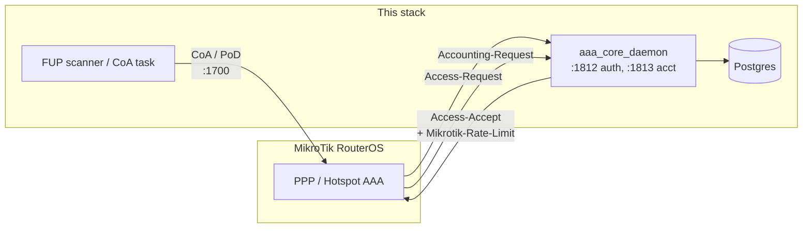

# MikroTik Integration & Go-Live Guide

**Audience: NOC engineers and installers bringing a MikroTik router onto this
BSS/OSS as a RADIUS NAS.** This is the router-side companion to
`21_OPG_Operator_Guide.md` §5.1–5.2, which covers the BSS-side API calls.
Troubleshooting a NAS already in production is `12_OPS_Operations_Runbook.md`
§12.3, not here.

Written 2026-08-17 against commit `c5f19d3`. MikroTik is the only NAS vendor
this codebase has bench-verified against real firmware — see the caveat in
§6 before treating any other vendor's section of `21_OPG` the same way.

---

## 1. What this integration is

RouterOS acts as a RADIUS client (NAS) against this stack's `aaa_core_daemon`.
Three things ride on that one relationship:

- **PPPoE / Hotspot authentication** — RouterOS sends Access-Request,
  `aaa_core_daemon` checks the subscriber and wallet, returns Accept/Reject.
- **Bandwidth control** — Accept (and later, CoA) carries the
  `Mikrotik-Rate-Limit` vendor attribute, so RouterOS enforces plan speed and
  FUP-throttled speed without any router-side profile editing.
- **Mid-session control** — the FUP scanner and quota logic push CoA
  (throttle) or PoD (disconnect) packets to the router when a subscriber
  crosses a threshold, without waiting for reauthentication.



---

## 2. Prerequisites

- The BSS stack is up (`./scripts/demo_up.sh` for a demo, or your production
  compose/orchestration) and `aaa_core_daemon` publishes UDP `1812` (auth) and
  `1813` (accounting) — confirm with `docker compose ps aaa_core_daemon`.
- Network reachability, both directions: the router must reach the daemon on
  1812/1813, and the daemon must reach the router on its CoA/PoD port (see
  §4) — these are two separate firewall rules, easy to only open one of.
- A RADIUS shared secret of at least 16 characters, generated fresh for this
  router. **Do not reuse `RADIUS_SECRET` from `.env`** — that value is only
  the fallback secret the resolver uses for an IP with no `nas_devices` row
  (`internal/nas/resolver.go`), kept for backward compatibility. A production
  NAS should be registered with its own secret so one router's compromise
  doesn't expose every other NAS on the account.
- A staff bearer token with `noc_engineer` or `isp_owner` role (NAS
  registration is restricted to those).
- If this is a production deployment rather than a demo: replace the
  self-signed TLS cert the demo stack ships with before exposing the API over
  a real network — see the ship-readiness notes in `DOD_STATUS_REPORT.md`.

---

## 3. Step 1 — Register the router as a NAS

```bash
curl -sk -X POST https://<bss-host>/api/v1/nas \
  -H "Authorization: Bearer $TOKEN" -H 'Content-Type: application/json' \
  -d '{"ip":"203.0.113.10","vendor":"mikrotik",
       "description":"Site name / rack location",
       "radius_secret":"<the 16+ char secret you generated>",
       "coa_port":1700,
       "allow_mab":false}'
```

- `ip` is the address the daemon will see the router's RADIUS packets
  come from — usually its management or loopback IP, not a customer-facing
  interface.
- `coa_port` defaults to `1700` in the schema (`migrations/022_create_nas_devices.sql`)
  because that's RouterOS's own default CoA/PoD listener port, **not** the
  RFC 5176 standard port `3799`. Leave it at `1700` unless you have changed
  RouterOS's `radius incoming` port.
- `allow_mab` controls MAC-Authentication-Bypass for Wi-Fi (§5.2 of the
  Operator Guide) — leave `false` unless this router does hotspot MAB.
- The secret is encrypted at the API edge and is never returned by any
  endpoint afterwards, including `GET`. To change it, `PATCH` a new one; there
  is no "reveal" path by design.
- **Allow up to 60 seconds** after registering or editing before the router's
  first login attempt — `aaa_core_daemon` caches the NAS inventory
  (`internal/nas/resolver.go`, `refreshInterval = 60s`) rather than hitting
  Postgres per packet, to keep the RADIUS hot path inside its 15ms p99 budget.
  Testing immediately will look like a broken registration.

`GET /api/v1/nas` lists everything registered, if you need to confirm the row
landed.

---

## 4. Step 2 — Configure RouterOS

Run these on the router itself (Winbox terminal, SSH, or a script pushed via
whatever provisioning path you use).

### 4.1 Add the RADIUS server

```
/radius
add service=ppp,hotspot address=<bss-radius-host> secret=<same secret as §3> \
    authentication-port=1812 accounting-port=1813 timeout=3s
```

Use the daemon's real, reachable address — if the BSS runs behind NAT or a
VPN concentrator, that's the address to use here, not the docker-internal one.

### 4.2 PPPoE

```
/ppp aaa
set use-radius=yes
```

Nothing else on the PPP side needs a profile edit for bandwidth — the
`Mikrotik-Rate-Limit` attribute in the Access-Accept sets it per session
(§5).

### 4.3 Hotspot / Wi-Fi

```
/ip hotspot profile
set [find] use-radius=yes
```

If this router will also do MAC-Authentication-Bypass (password-less
reconnect for known devices), set `allow_mab: true` in §3 *and*:

```
/ip hotspot profile
set [find] login-by=mac,http-chap
```

**Known limitation, not a misconfiguration on your end**: the captive portal
this stack serves issues a grant and then relies on the router retrying MAC
auth — it does not complete RouterOS's own login handshake by POSTing to
`$(link-login-only)`. In practice this means a user sees a "turn Wi-Fi off
and back on" instruction after paying/verifying, rather than being connected
immediately. Set expectations with site staff accordingly.

Also add the portal host to the walled garden, or a client cannot reach the
sign-in page at all before it's authenticated:

```
/ip hotspot walled-garden
add dst-host=<bss-host>
```

### 4.4 CoA / PoD (mid-session control)

RouterOS must be told to accept incoming CoA/disconnect requests from the
BSS, on the port you set in §3 (`1700` unless changed):

```
/radius incoming
set accept=yes port=1700
```

Without this step, PPPoE/hotspot logins and speed still work — only FUP
throttling and remote disconnect will silently fail to reach the router.
That failure mode is quiet (no login is rejected), so verify it explicitly in
§5 rather than assuming it's working because auth is.

---

## 5. Rate limiting and CoA — how it actually reaches the router

Plans carry a `rate_limit_string` in the format RouterOS itself uses,
`download/upload` (e.g. `"50M/50M"`, `"10M/2M"`). This is sent as-is inside
vendor attribute 14988/8 (`Mikrotik-Rate-Limit`) — see
`internal/nas/mikrotik.go`, the reference implementation the other seven
vendor builders in `internal/nas/` follow the same interface as.

- On login: attached to the Access-Accept, so no separate step is needed —
  RouterOS applies it as part of the session.
- Mid-session: when the FUP scanner or quota logic decides a subscriber's
  speed should change, `internal/fup/coa_task.go` sends a CoA packet with the
  same attribute, targeting the NAS's registered `coa_port`. RouterOS updates
  the live session without dropping it.
- Full disconnect (voucher exhaustion, suspension) uses a PoD packet on
  `pod_port` instead — the session ends rather than throttles, deliberately
  (see `HANDOFF.md`'s note on prepaid vouchers: a crawling connection reads as
  a broken network, not a spent voucher).

---

## 6. Verification checklist before calling this router live

Run these in order — each one isolates a different failure mode, and running
them out of order tends to misattribute a CoA problem to auth or vice versa.

1. **Auth.** Connect a real or test PPPoE/hotspot client with valid
   subscriber credentials. Confirm an Accept in `aaa_core_daemon`'s logs
   (or the "RADIUS / Network Commands" Grafana dashboard referenced in
   `12_OPS_Operations_Runbook.md`).
2. **Rate limit applied.** On the router, `/ppp active print` or
   `/ip hotspot active print` and confirm the session's rate matches the
   subscriber's plan, not RouterOS's queue default.
3. **Accounting.** Confirm `subscriber_session_history` is getting rows for
   this session — the LEA-lookup feature and FUP metering both depend on
   accounting actually landing, not just auth succeeding.
4. **CoA reaches the router.** Trigger a manual rate change (or wait for a
   real FUP threshold crossing) and confirm the session's live rate changes
   on the router without a reconnect. If it doesn't, recheck §4.4 first —
   this is the single most commonly missed step.
5. **MAB, if enabled.** Disconnect and reconnect a known device's Wi-Fi with
   no captive-portal interaction; confirm it reauthenticates by MAC alone.

---

## 7. Go-live caveats

- **MikroTik is the only vendor actually tested against real firmware** in
  this codebase's current state (`DOD_STATUS_REPORT.md`, ship-readiness
  section). The other seven vendors in `nas_devices`'s vendor list are
  implemented from documentation and carry `TODO-VERIFY` markers
  (`internal/nas/{huawei,zte,wireless}.go`) — do not assume the same
  confidence for a mixed-vendor rollout.
- **Demo secrets must never reach a production router.** `RADIUS_SECRET` in
  `.env` and the seeded demo accounts in `21_OPG_Operator_Guide.md` §1 are
  published in this repository; a production NAS gets its own secret via §3,
  full stop.
- **Self-signed TLS** is fine for registering a NAS against a demo stack over
  localhost; it is not fine for a router or staff client crossing a real
  network to reach the API. Replace it before go-live.
- **The captive portal's MikroTik login is not the native flow** — see §4.3.
  This is a UX rough edge, not a security or billing gap.
